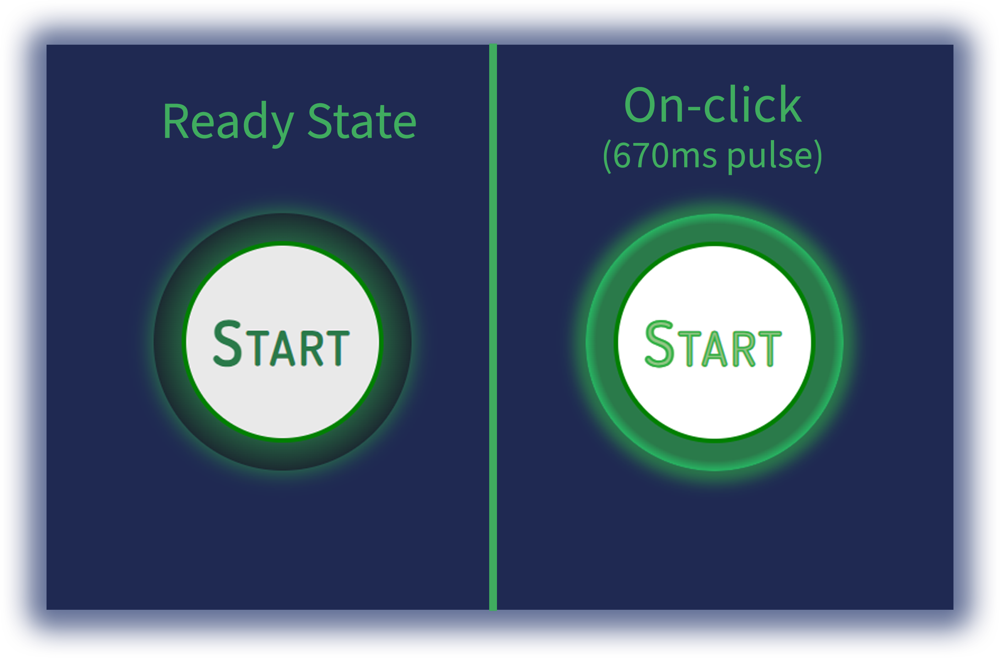

# Glow-on-Submit Button

This is a stylized submit button that has an outer ring that glows when you click the "Start" button.  

### Screenshot

## Description

I use a version of this for the contact form on my personal portfolio site (www.obsidiandesignstudios.com).  I've received a some positive feedback on the feature, so I wanted to share the component with the community.  It's a small, uncomplicated piece of code, but I think it's a cool way to confirm a button click.

### Built with

- Semantic HTML5 markup
- JavaScript
- CSS

## Author

Greg Gaines 

[LinkedIn](https://www.linkedin.com/in/greg-gaines-22009295)

[Obsidian Design Studios](https://obsidiandesignstudios.com)
